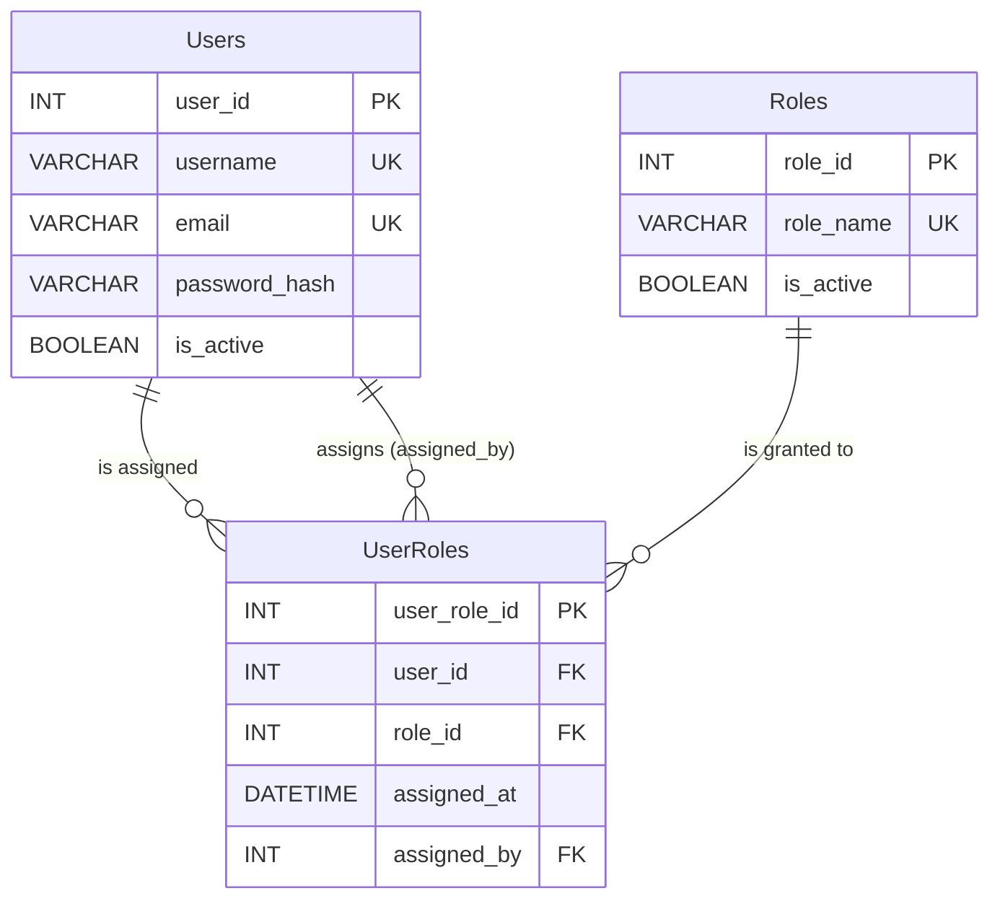

# Security Architecture

## Week 4 Deliverable — LDMAS

| Field             | Detail                                                                    |
|-------------------|---------------------------------------------------------------------------|
| **Author**        | Salih                                                                     |
| **Date**          | 2026-08-10                                                                |
| **Version**       | 1.0                                                                       |
| **Milestone**     | Week 4 — Information Systems Security Protocols                           |
| **Tech Stack**    | C# 10+ · BCrypt.Net-Next · MySql.Data · MySQL 8.0                        |
| **Prerequisites** | [Requirements.md](../Requirements.md) · [BackendArchitecture.md](BackendArchitecture.md) |

---

## Table of Contents

1. [Security Overview](#1-security-overview)
2. [Password Hashing — BCrypt](#2-password-hashing--bcrypt)
3. [Authentication Flow](#3-authentication-flow)
4. [Role-Based Access Control (RBAC)](#4-role-based-access-control-rbac)
5. [SQL Injection Prevention](#5-sql-injection-prevention)
6. [Brute-Force Attack Mitigation](#6-brute-force-attack-mitigation)
7. [Audit Trail & Authentication Logging](#7-audit-trail--authentication-logging)
8. [Credential Storage & Configuration Security](#8-credential-storage--configuration-security)
9. [Security Checklist](#9-security-checklist)
10. [OWASP Alignment](#10-owasp-alignment)
11. [Next Steps — Week 5 Preview](#11-next-steps--week-5-preview)

---

## 1. Security Overview

### 1.1 Security Objective

The LDMAS security architecture is designed to protect sensitive laboratory research data through a **defense-in-depth** strategy — multiple independent layers of security controls, each providing redundancy should another layer fail.

### 1.2 Threat Model

| Threat                           | Risk Level | Mitigation                                        | Implemented |
|----------------------------------|------------|---------------------------------------------------|:-----------:|
| SQL Injection                    | Critical   | Parameterized queries (all DAL methods)           | ✅ Week 3   |
| Plaintext password storage       | Critical   | BCrypt hashing with cost factor ≥ 12              | ✅ Week 4   |
| Brute-force login attacks        | High       | Failed attempt counting + temporary lockout       | ✅ Week 4   |
| Unauthorized data access         | High       | Role-Based Access Control (4 roles)               | ✅ Week 4   |
| Credential leakage via source    | High       | Environment variables + .gitignore enforcement    | ✅ Week 3   |
| Timing attacks on login          | Medium     | BCrypt constant-time comparison + dummy hashing   | ✅ Week 4   |
| Unaudited data modifications     | Medium     | Immutable AuditLog with MySQL triggers            | ✅ Week 2   |
| Session hijacking                | Medium     | Session timeout enforcement (FR-005)              | 🔲 Week 5   |
| Cross-Site Scripting (XSS)       | Medium     | Input sanitization at presentation layer          | 🔲 Week 5   |

### 1.3 Security Layer Architecture

```
┌─────────────────────────────────────────────────────────────────────────┐
│                        SECURITY LAYERS                                 │
├─────────────────────────────────────────────────────────────────────────┤
│                                                                         │
│  Layer 1: INPUT VALIDATION                                              │
│  ┌───────────────────────────────────────────────────────────────────┐  │
│  │ • Username/password required field checks                        │  │
│  │ • Password strength policy (8+ chars, upper/lower/digit/special) │  │
│  │ • Email format validation                                        │  │
│  │ • Field length constraints matching DB schema                    │  │
│  └───────────────────────────────────────────────────────────────────┘  │
│                                                                         │
│  Layer 2: AUTHENTICATION                                                │
│  ┌───────────────────────────────────────────────────────────────────┐  │
│  │ • BCrypt password hashing (cost = 12, ≈250ms per hash)           │  │
│  │ • Constant-time password comparison                               │  │
│  │ • Dummy hash on invalid username (timing attack prevention)       │  │
│  │ • Account deactivation (soft-delete lockout)                      │  │
│  └───────────────────────────────────────────────────────────────────┘  │
│                                                                         │
│  Layer 3: AUTHORIZATION (RBAC)                                          │
│  ┌───────────────────────────────────────────────────────────────────┐  │
│  │ • 4 system roles: Admin, Manager, Technician, Auditor             │  │
│  │ • Many-to-many user-role mapping (UserRoles junction table)       │  │
│  │ • Admin override (full access to all modules)                     │  │
│  │ • IsAuthorized() static method for BLL enforcement                │  │
│  └───────────────────────────────────────────────────────────────────┘  │
│                                                                         │
│  Layer 4: DATA PROTECTION                                               │
│  ┌───────────────────────────────────────────────────────────────────┐  │
│  │ • Parameterized SQL queries (all CRUD operations)                 │  │
│  │ • Connection string passwords from environment variables          │  │
│  │ • password_hash never returned to Presentation layer              │  │
│  │ • SSL/TLS preferred for MySQL connections                         │  │
│  └───────────────────────────────────────────────────────────────────┘  │
│                                                                         │
│  Layer 5: AUDITING                                                      │
│  ┌───────────────────────────────────────────────────────────────────┐  │
│  │ • AuthenticationLog: every login attempt (success + failure)      │  │
│  │ • AuditLog: every INSERT/UPDATE/DELETE via MySQL triggers         │  │
│  │ • Immutable records (no UPDATE/DELETE on audit tables)            │  │
│  └───────────────────────────────────────────────────────────────────┘  │
│                                                                         │
└─────────────────────────────────────────────────────────────────────────┘
```

---

## 2. Password Hashing — BCrypt

### 2.1 Why BCrypt?

BCrypt is a **password-specific** hashing algorithm designed to be computationally expensive, making brute-force and rainbow table attacks impractical. Unlike general-purpose hash functions (MD5, SHA-256), BCrypt includes:

| Feature                 | BCrypt                           | SHA-256                     | MD5                       |
|-------------------------|----------------------------------|-----------------------------|---------------------------|
| Designed for passwords  | ✅ Yes                           | ❌ No (general-purpose)     | ❌ No (general-purpose)   |
| Built-in salt           | ✅ Automatic per-hash salt       | ❌ Must add manually        | ❌ Must add manually      |
| Adaptive cost factor    | ✅ Configurable work factor      | ❌ Fixed speed              | ❌ Fixed speed            |
| Timing-safe comparison  | ✅ Constant-time verify          | ❌ Must implement manually  | ❌ Must implement manually|
| Rainbow table resistant | ✅ Salt makes each hash unique   | ⚠️ Only with salt           | ⚠️ Only with salt         |
| Speed (per hash)        | ~250ms (cost=12)                 | ~0.001ms                    | ~0.0005ms                 |

### 2.2 BCrypt Hash Format

```
$2a$12$LJ3m4ys5Qp8Wk.vG7rZ1GeZKxHw5FqNBcUvR9aE3n0yF1dS2hJ6Oe
 │  │  │                                                          │
 │  │  └─── 22-character salt ──────────── 31-character hash ──────┘
 │  └────── Cost factor (12 = 2^12 = 4,096 iterations)
 └───────── Algorithm identifier ($2a = BCrypt)
```

**Key properties:**
- Each hash is **60 characters** long.
- The salt is **embedded within the hash** — no separate salt column needed.
- Identical passwords produce **different hashes** due to random salt generation.

### 2.3 Cost Factor Selection

LDMAS uses a cost factor of **12** as mandated by NFR-001:

| Cost Factor | Iterations | Approx. Time | Suitability                  |
|-------------|------------|---------------|-------------------------------|
| 10          | 1,024      | ~65ms         | Development/testing only      |
| **12**      | **4,096**  | **~250ms**    | **LDMAS production default**  |
| 14          | 16,384     | ~1s           | High-security environments    |
| 16          | 65,536     | ~4s           | Maximum security (slow UX)    |

**Rationale:** Cost factor 12 provides ~250ms hashing time, which is imperceptible to legitimate users during login but forces an attacker to spend ~250ms per password guess. At this rate, a brute-force attack against even a simple 8-character password space would take years.

### 2.4 Implementation in LDMAS

**Registration — Hashing a new password:**

```csharp
// BCrypt.Net generates a random salt and embeds it in the hash
string passwordHash = BCrypt.Net.BCrypt.EnhancedHashPassword(
    plainTextPassword,
    workFactor: 12  // NFR-001: minimum cost factor of 12
);

// Store only the hash — the plaintext is never persisted
// INSERT INTO Users (..., password_hash) VALUES (..., @PasswordHash)
```

**Login — Verifying a password:**

```csharp
// BCrypt extracts the salt from the stored hash and re-hashes the input
bool isValid = BCrypt.Net.BCrypt.EnhancedVerify(
    plainTextPassword,  // User's input
    storedHash          // From database: $2a$12$LJ3m...
);
// Returns true only if the input, when hashed with the same salt, matches
```

### 2.5 Password Policy

The `ValidatePasswordStrength()` method enforces these rules before hashing:

| Rule                                  | Requirement                     |
|---------------------------------------|---------------------------------|
| Minimum length                        | 8 characters                    |
| At least one uppercase letter         | [A-Z]                           |
| At least one lowercase letter         | [a-z]                           |
| At least one digit                    | [0-9]                           |
| At least one special character        | Any non-alphanumeric character  |

---

## 3. Authentication Flow

### 3.1 Login Sequence Diagram

```
  User                   AuthService               MySQL (Users)        MySQL (AuthLog)
   │                         │                          │                     │
   │  Login(user, pass)      │                          │                     │
   │────────────────────────▶│                          │                     │
   │                         │                          │                     │
   │                         │  Count failed attempts   │                     │
   │                         │─────────────────────────────────────────────▶│
   │                         │◀─────────────────────────────────────────────│
   │                         │                          │                     │
   │                         │  [If ≥5 failures in 30m] │                     │
   │  ◀── "Account locked"  │                          │                     │
   │                         │                          │                     │
   │                         │  SELECT by username      │                     │
   │                         │─────────────────────────▶│                     │
   │                         │◀─────────────────────────│                     │
   │                         │                          │                     │
   │                         │  [User not found]        │                     │
   │                         │  BCrypt dummy hash ──┐   │                     │
   │                         │                      │   │                     │
   │                         │◀─────────────────────┘   │                     │
   │                         │  Log FAILURE ────────────────────────────────▶│
   │  ◀── "Invalid creds"   │                          │                     │
   │                         │                          │                     │
   │                         │  [User found]            │                     │
   │                         │  Check is_active         │                     │
   │                         │  BCrypt.Verify(pass, hash)                     │
   │                         │                          │                     │
   │                         │  [Password invalid]      │                     │
   │                         │  Log FAILURE ────────────────────────────────▶│
   │  ◀── "Invalid creds"   │                          │                     │
   │                         │                          │                     │
   │                         │  [Password valid]        │                     │
   │                         │  Load roles (UserRoles)  │                     │
   │                         │─────────────────────────▶│                     │
   │                         │◀─────────────────────────│                     │
   │                         │                          │                     │
   │                         │  UPDATE last_login_at    │                     │
   │                         │─────────────────────────▶│                     │
   │                         │                          │                     │
   │                         │  Log SUCCESS ────────────────────────────────▶│
   │                         │                          │                     │
   │  ◀── AuthResult{User}  │                          │                     │
   │       (with roles)      │                          │                     │
```

### 3.2 Security Properties of the Login Flow

| Property                    | Implementation                                                              |
|-----------------------------|-----------------------------------------------------------------------------|
| **No username enumeration** | Returns the same "Invalid username or password" message for both non-existent usernames and wrong passwords. |
| **Timing attack prevention** | When a username is not found, a dummy BCrypt hash is still performed to equalize response time. |
| **Brute-force throttling**  | After 5 failed attempts within 30 minutes, the account is temporarily locked. |
| **Audit logging**           | Every attempt (success or failure) is recorded with timestamp, IP, and user-agent. |
| **Deactivated account check** | Accounts with `is_active = FALSE` are rejected before password verification. |

---

## 4. Role-Based Access Control (RBAC)

### 4.1 Role Definitions

LDMAS implements RBAC via three database tables: `Users`, `Roles`, and `UserRoles` (many-to-many junction table). The system ships with four predefined roles:

| Role            | Scope                                                              | DB Seed |
|-----------------|--------------------------------------------------------------------|:-------:|
| **Admin**       | Full system access. User management, configuration, all modules.   | ✅      |
| **Manager**     | Experiment approval/rejection, equipment management, reporting.    | ✅      |
| **Technician**  | Data entry for experiments, samples, test results, inventory.      | ✅      |
| **Auditor**     | Read-only access to audit trails, reports, and historical data.    | ✅      |

### 4.2 RBAC Database Schema



### 4.3 Authorization Matrix

| Action                          | Admin | Manager | Technician | Auditor |
|---------------------------------|:-----:|:-------:|:----------:|:-------:|
| **User Management**             |       |         |            |         |
| Create user accounts            | ✅    | ❌      | ❌         | ❌      |
| Deactivate user accounts        | ✅    | ❌      | ❌         | ❌      |
| Assign/revoke roles             | ✅    | ❌      | ❌         | ❌      |
| Reset user passwords            | ✅    | ❌      | ❌         | ❌      |
| **Experiment Management**       |       |         |            |         |
| Create experiments              | ✅    | ✅      | ✅         | ❌      |
| Edit own experiments            | ✅    | ✅      | ✅         | ❌      |
| Approve/reject experiments      | ✅    | ✅      | ❌         | ❌      |
| Delete experiments              | ✅    | ✅      | ❌         | ❌      |
| **Sample & Test Results**       |       |         |            |         |
| Register samples                | ✅    | ✅      | ✅         | ❌      |
| Record test results             | ✅    | ✅      | ✅         | ❌      |
| **Equipment**                   |       |         |            |         |
| Register/edit equipment         | ✅    | ✅      | ❌         | ❌      |
| Record calibrations             | ✅    | ✅      | ✅         | ❌      |
| Decommission equipment          | ✅    | ✅      | ❌         | ❌      |
| **Inventory**                   |       |         |            |         |
| Add/consume inventory items     | ✅    | ✅      | ✅         | ❌      |
| **Reporting & Audit**           |       |         |            |         |
| Generate reports                | ✅    | ✅      | ✅         | ✅      |
| Export data (CSV/PDF)           | ✅    | ✅      | ❌         | ✅      |
| View audit trail                | ✅    | ❌      | ❌         | ✅      |

### 4.4 Enforcement in Code

RBAC is enforced at the **Business Logic Layer** using the `IsAuthorized()` method:

```csharp
// Example: Only Admin and Manager can approve experiments
public bool ApproveExperiment(User currentUser, int experimentId, string comments)
{
    // RBAC check — deny if unauthorized
    if (!AuthenticationService.IsAuthorized(currentUser, "Admin", "Manager"))
    {
        Console.Error.WriteLine($"[BLL] Access denied — User '{currentUser.Username}' " +
                                $"lacks required role for experiment approval.");
        return false;
    }

    // Proceed with business logic...
}
```

**Design decision — Admin override:** The `IsAuthorized()` method grants Admin users automatic access to all operations regardless of the required roles passed. This simplifies authorization checks while ensuring the system administrator can always intervene.

---

## 5. SQL Injection Prevention

### 5.1 Attack Vector

SQL injection occurs when untrusted user input is concatenated directly into SQL statements, allowing an attacker to manipulate the query:

```csharp
// ❌ VULNERABLE — attacker inputs: ' OR '1'='1' --
string sql = "SELECT * FROM Users WHERE username = '" + userInput + "'";
// Resulting SQL: SELECT * FROM Users WHERE username = '' OR '1'='1' --'
// This returns ALL users — authentication bypassed!
```

### 5.2 LDMAS Prevention Strategy — Parameterized Queries

Every SQL operation in LDMAS uses `MySqlParameter` objects, which separate SQL structure from data:

```csharp
// ✅ SECURE — parameterized query (used throughout LDMAS)
string sql = "SELECT * FROM Users WHERE username = @Username";
using (var cmd = new MySqlCommand(sql, connection))
{
    cmd.Parameters.AddWithValue("@Username", userInput);
    // MySQL treats @Username as a DATA value, never as SQL syntax
    // Attacker's input is treated as a literal string, not code
}
```

### 5.3 How Parameterization Works

```
┌─────────────────────────────────────────────────────────────────────┐
│                      MySQL Query Execution                         │
├─────────────────────────────────────────────────────────────────────┤
│                                                                     │
│  Without Parameters (VULNERABLE):                                   │
│                                                                     │
│    "SELECT * FROM Users WHERE username = '" + input + "'"           │
│                                                                     │
│    ┌──────────────────────────────────────────────┐                  │
│    │ SQL Parser sees:                              │                  │
│    │   SELECT * FROM Users WHERE username = ''     │                  │
│    │   OR '1'='1' --                               │ ← Injected SQL  │
│    └──────────────────────────────────────────────┘                  │
│                                                                     │
│  With Parameters (SECURE):                                          │
│                                                                     │
│    "SELECT * FROM Users WHERE username = @Username"                 │
│    @Username = "' OR '1'='1' --"                                    │
│                                                                     │
│    ┌──────────────────────────────────────────────┐                  │
│    │ SQL Parser sees:                              │                  │
│    │   SELECT * FROM Users WHERE username =        │                  │
│    │   [literal: "' OR '1'='1' --"]                │ ← Treated as    │
│    │                                               │   plain text     │
│    └──────────────────────────────────────────────┘                  │
│                                                                     │
└─────────────────────────────────────────────────────────────────────┘
```

### 5.4 Coverage Audit

| File                        | Methods | All Parameterized | Verified |
|-----------------------------|---------|:-----------------:|:--------:|
| `DatabaseConnection.cs`     | 0 (factory only)  | N/A       | ✅       |
| `EquipmentRepository.cs`    | 12      | ✅                | ✅ Week 3|
| `AuthenticationService.cs`  | 15+     | ✅                | ✅ Week 4|

**Zero string-concatenated SQL** exists anywhere in the LDMAS codebase.

---

## 6. Brute-Force Attack Mitigation

### 6.1 Mechanism

The `AuthenticateUser()` method counts recent failed login attempts before processing credentials:

```csharp
// Count failures in the last 30 minutes for this username
SELECT COUNT(*) FROM AuthenticationLog
WHERE username = @Username
  AND attempt_result = 'Failure'
  AND attempted_at > DATE_SUB(NOW(), INTERVAL 30 MINUTE);
```

### 6.2 Policy

| Parameter                        | Value       | Rationale                                 |
|----------------------------------|-------------|-------------------------------------------|
| Max failed attempts              | 5           | Balances security vs. legitimate typos     |
| Lockout window                   | 30 minutes  | Self-resolving; no admin intervention required |
| Lockout scope                    | Per-username | Prevents cross-user lockout attacks        |

### 6.3 Attack Cost Calculation

With BCrypt cost factor 12 and brute-force lockout:

```
Time per guess:        ~250ms (BCrypt cost=12)
Attempts before lock:  5
Lockout window:        30 minutes

Effective attack rate: 5 attempts / 30 minutes = 0.17 attempts/minute
Time to exhaust 8-char password space: ~1.7 × 10¹⁰ years
```

---

## 7. Audit Trail & Authentication Logging

### 7.1 AuthenticationLog Table

Every call to `AuthenticateUser()` generates an entry in `AuthenticationLog` regardless of outcome:

| Column           | Logged On Success | Logged On Failure | Purpose                     |
|------------------|:-----------------:|:-----------------:|-----------------------------|
| `user_id`        | ✅                | ✅ (or NULL)      | Links to Users table        |
| `username`       | ✅                | ✅                | Captured even if not found  |
| `attempt_result` | `Success`         | `Failure`         | Outcome classification      |
| `ip_address`     | ✅                | ✅                | Source identification       |
| `user_agent`     | ✅                | ✅                | Client fingerprinting       |
| `attempted_at`   | ✅                | ✅                | Timestamp (auto by MySQL)   |

### 7.2 AuditLog Integration

Data modifications triggered by authenticated users are logged via MySQL triggers (implemented in Week 2):

```
User authenticates → Sets @app_user_id session variable
    → Performs CRUD operation
        → MySQL trigger fires
            → AuditLog entry created with changed_by = @app_user_id
```

---

## 8. Credential Storage & Configuration Security

### 8.1 Password Storage

| Data                     | Storage                    | Encryption      |
|--------------------------|----------------------------|------------------|
| Plaintext password       | **Never stored anywhere**  | N/A              |
| BCrypt hash              | `Users.password_hash`      | One-way hash     |
| DB connection password   | Environment variable       | OS-level         |

### 8.2 Configuration Precedence

```
Priority 1 (Highest): $LDMAS_DB_PASSWORD environment variable
Priority 2:           App.config <connectionStrings> section
Priority 3:           App.config <appSettings> individual keys
Priority 4 (Lowest):  Hardcoded defaults (no password — connection will fail)
```

### 8.3 Files That Must Never Be Committed

```gitignore
# Credentials & secrets
**/App.config
**/appsettings.json
**/appsettings.*.json
**/secrets.json

# Build artifacts
**/bin/
**/obj/
```

---

## 9. Security Checklist

### Phase I (Weeks 3–4) ✅

- [x] All SQL queries use parameterized `MySqlParameter` objects
- [x] Passwords hashed with BCrypt (cost factor ≥ 12)
- [x] Plaintext passwords never stored, logged, or returned
- [x] Database credentials read from environment variables
- [x] Connection strings never hardcoded in source code
- [x] Role-Based Access Control with 4 predefined roles
- [x] Authentication logging (success + failure) to `AuthenticationLog`
- [x] Brute-force detection (5 failures / 30-minute window)
- [x] Timing attack prevention (dummy hash on invalid username)
- [x] Password strength policy enforcement (8+ chars, complexity rules)
- [x] Transactional user registration (user + role in single transaction)
- [x] Account deactivation (soft delete) capability

### Phase II (Weeks 5–6) 🔲

- [ ] Session timeout enforcement (FR-005)
- [ ] Input sanitization for XSS prevention (NFR-003)
- [ ] Defense-in-depth: client-side + server-side validation (NFR-022)
- [ ] Separate DB user accounts with least-privilege (NFR-005)
- [ ] Sensitive field encryption at rest (NFR-006)

---

## 10. OWASP Alignment

The security measures implemented in LDMAS align with the [OWASP Top 10 (2021)](https://owasp.org/www-project-top-ten/):

| OWASP Category                        | LDMAS Coverage                                             | Status |
|---------------------------------------|-------------------------------------------------------------|:------:|
| A01: Broken Access Control            | RBAC with 4 roles, authorization checks in BLL              | ✅     |
| A02: Cryptographic Failures           | BCrypt hashing, no plaintext storage, env var credentials   | ✅     |
| A03: Injection                        | 100% parameterized queries across all DAL methods           | ✅     |
| A04: Insecure Design                  | Defense-in-depth, immutable audit trail, threat modeling    | ✅     |
| A05: Security Misconfiguration        | .gitignore enforcement, template configs committed          | ✅     |
| A06: Vulnerable Components            | NuGet packages (MySql.Data, BCrypt.Net-Next) regularly updated | ⚠️   |
| A07: Auth & Identification Failures   | BCrypt, brute-force lockout, timing-safe comparison         | ✅     |
| A08: Software & Data Integrity        | Immutable AuditLog, transactional data modifications        | ✅     |
| A09: Logging & Monitoring Failures    | AuthenticationLog, AuditLog with full operation tracking    | ✅     |
| A10: Server-Side Request Forgery      | Not applicable (no external URL fetching)                   | N/A    |

---

## 11. Next Steps — Week 5 Preview

### Feature Modules — CRUD Operations, Validation & Workflows

Week 5 will extend the backend with additional feature modules:

1. **Experiment & Sample Repositories** — CRUD operations for `Experiments`, `Samples`, and `TestResults` tables, following the repository pattern from `EquipmentRepository`.

2. **Experiment Status Workflow** — Implement the state machine for experiment status transitions: `Draft → In Progress → Awaiting Review → Approved/Rejected → Archived` (FR-015).

3. **Business Logic Validation** — Field-level and cross-field validation for data entry (FR-014), including numeric range checks and mandatory field enforcement.

4. **Session Management** — Implement configurable session timeout (FR-005, default: 30 minutes of inactivity).

5. **Input Sanitization** — XSS prevention at the presentation layer input boundary (NFR-003).

---

> **Document Classification:** Internal — Internship Project Documentation  
> **Sensitivity Level:** Contains security architecture details — do not share externally.  
> **Repository:** [LaboratuvaryAutomation](https://github.com/SALIH-A/LaboratuvaryAutomation)  
> **Parent Documents:** [Requirements.md](../Requirements.md) · [BackendArchitecture.md](BackendArchitecture.md)
