# System Architecture and Database Design

## Week 2 Deliverable — LDMAS

| Field             | Detail                                                            |
|-------------------|-------------------------------------------------------------------|
| **Author**        | Salih                                                             |
| **Date**          | 2026-07-25                                                        |
| **Version**       | 1.0                                                               |
| **Milestone**     | Week 2 — System Architecture & Database Design                    |
| **Tech Stack**    | C# (.NET) · MySQL 8.0+ · Entity Framework Core                   |
| **Prerequisite**  | [Requirements.md](../Requirements.md) (Week 1)                    |

---

## Table of Contents

1. [System Architecture Overview](#1-system-architecture-overview)
2. [Layered Architecture Design](#2-layered-architecture-design)
3. [Entity-Relationship Diagram](#3-entity-relationship-diagram)
4. [Data Dictionary](#4-data-dictionary)
5. [Database Design Decisions](#5-database-design-decisions)
6. [Security Architecture](#6-security-architecture)
7. [Next Steps — Week 3 Preview](#7-next-steps--week-3-preview)

---

## 1. System Architecture Overview

### 1.1 Architectural Pattern

LDMAS employs a **Three-Tier Layered Architecture** pattern, which provides clear separation of concerns, testability, and maintainability — all critical for a system that must enforce data integrity and audit compliance in a laboratory setting.

```
┌─────────────────────────────────────────────────────────────────┐
│                    PRESENTATION LAYER                           │
│         (Windows Forms / WPF / ASP.NET Razor Pages)             │
│                                                                 │
│   ┌──────────┐  ┌──────────┐  ┌──────────┐  ┌──────────┐       │
│   │  Login   │  │Experiment│  │Equipment │  │ Reports  │       │
│   │  View    │  │  Views   │  │  Views   │  │  Views   │       │
│   └──────────┘  └──────────┘  └──────────┘  └──────────┘       │
├─────────────────────────────────────────────────────────────────┤
│                    BUSINESS LOGIC LAYER (BLL)                   │
│                                                                 │
│   ┌──────────┐  ┌──────────┐  ┌──────────┐  ┌──────────┐       │
│   │  Auth    │  │Experiment│  │Equipment │  │ Report   │       │
│   │ Service  │  │ Service  │  │ Service  │  │ Service  │       │
│   └──────────┘  └──────────┘  └──────────┘  └──────────┘       │
│   ┌──────────┐  ┌──────────┐  ┌──────────┐                     │
│   │Inventory │  │  Audit   │  │Validation│                     │
│   │ Service  │  │ Service  │  │  Engine  │                     │
│   └──────────┘  └──────────┘  └──────────┘                     │
├─────────────────────────────────────────────────────────────────┤
│                    DATA ACCESS LAYER (DAL)                      │
│                                                                 │
│   ┌──────────┐  ┌──────────┐  ┌──────────┐  ┌──────────┐       │
│   │  User    │  │Experiment│  │Equipment │  │  Audit   │       │
│   │  Repo    │  │   Repo   │  │   Repo   │  │   Repo   │       │
│   └──────────┘  └──────────┘  └──────────┘  └──────────┘       │
│                                                                 │
│           ┌─────────────────────────────┐                       │
│           │   DbContext / Connection    │                       │
│           │   (MySQL + EF Core/Dapper)  │                       │
│           └──────────┬──────────────────┘                       │
├──────────────────────┼──────────────────────────────────────────┤
│                      ▼                                          │
│               ┌──────────────┐                                  │
│               │   MySQL 8.0  │                                  │
│               │   ldmas_db   │                                  │
│               └──────────────┘                                  │
│                  DATABASE LAYER                                 │
└─────────────────────────────────────────────────────────────────┘
```

### 1.2 Layer Responsibilities

| Layer                      | Responsibility                                                                                          | Technology                    |
|----------------------------|---------------------------------------------------------------------------------------------------------|-------------------------------|
| **Presentation Layer**     | Renders UI components, captures user input, and delegates commands to the BLL. Contains no business logic. | WPF / WinForms / Razor Pages |
| **Business Logic Layer**   | Enforces domain rules, validates data, manages workflows (e.g., experiment status transitions), and orchestrates cross-cutting concerns (auth, audit). | C# Services, DI              |
| **Data Access Layer**      | Encapsulates all database interactions via Repository pattern. Translates domain objects to/from SQL.   | EF Core / Dapper, MySQL       |
| **Database Layer**         | Stores persistent data, enforces referential integrity, executes triggers and stored procedures.        | MySQL 8.0+                    |

### 1.3 Cross-Cutting Concerns

```
┌───────────────────────────────────────────────────┐
│              CROSS-CUTTING CONCERNS               │
│                                                   │
│  ┌────────────┐ ┌──────────┐ ┌─────────────────┐  │
│  │  Logging   │ │  Audit   │ │  Authentication │  │
│  │ (NLog /    │ │  Trail   │ │  & Authorization│  │
│  │  Serilog)  │ │ (FR-040) │ │  (RBAC FR-004)  │  │
│  └────────────┘ └──────────┘ └─────────────────┘  │
│  ┌────────────┐ ┌──────────┐ ┌─────────────────┐  │
│  │  Exception │ │   DI     │ │  Configuration  │  │
│  │  Handling  │ │Container │ │  Management     │  │
│  └────────────┘ └──────────┘ └─────────────────┘  │
└───────────────────────────────────────────────────┘
```

---

## 2. Layered Architecture Design

### 2.1 Project Structure

The recommended C# solution structure follows clean separation by layer and module:

```
LaboratuvarAutomation/
├── src/
│   ├── LDMAS.Presentation/           # UI Layer
│   │   ├── Forms/                    # WinForms or WPF views
│   │   ├── ViewModels/               # MVVM view models (if WPF)
│   │   └── Program.cs               # Application entry point
│   │
│   ├── LDMAS.BusinessLogic/          # Business Logic Layer
│   │   ├── Services/
│   │   │   ├── AuthenticationService.cs
│   │   │   ├── ExperimentService.cs
│   │   │   ├── EquipmentService.cs
│   │   │   ├── InventoryService.cs
│   │   │   ├── ReportService.cs
│   │   │   └── AuditService.cs
│   │   ├── Interfaces/
│   │   │   ├── IAuthenticationService.cs
│   │   │   ├── IExperimentService.cs
│   │   │   └── ...
│   │   └── Validation/
│   │       └── ExperimentValidator.cs
│   │
│   ├── LDMAS.DataAccess/             # Data Access Layer
│   │   ├── Context/
│   │   │   └── LdmasDbContext.cs     # EF Core DbContext
│   │   ├── Repositories/
│   │   │   ├── UserRepository.cs
│   │   │   ├── ExperimentRepository.cs
│   │   │   ├── EquipmentRepository.cs
│   │   │   └── AuditRepository.cs
│   │   ├── Interfaces/
│   │   │   ├── IUserRepository.cs
│   │   │   └── ...
│   │   └── Migrations/               # EF Core migrations
│   │
│   └── LDMAS.Domain/                 # Shared Domain Models
│       ├── Entities/
│       │   ├── User.cs
│       │   ├── Role.cs
│       │   ├── Experiment.cs
│       │   ├── Sample.cs
│       │   ├── TestResult.cs
│       │   ├── Equipment.cs
│       │   ├── CalibrationRecord.cs
│       │   ├── InventoryItem.cs
│       │   └── AuditLogEntry.cs
│       ├── Enums/
│       │   ├── ExperimentStatus.cs
│       │   ├── EquipmentStatus.cs
│       │   └── TransactionType.cs
│       └── DTOs/
│           ├── ExperimentFilterDto.cs
│           └── DashboardSummaryDto.cs
│
├── tests/
│   ├── LDMAS.BusinessLogic.Tests/    # Unit tests for BLL
│   └── LDMAS.DataAccess.Tests/       # Integration tests for DAL
│
├── database/
│   ├── ldmas_schema.sql              # DDL script (this Week 2 deliverable)
│   └── seed_data.sql                 # Extended seed data (Week 3)
│
├── docs/
│   ├── SystemArchitecture.md         # This document
│   └── DataDictionary.md             # (Week 3)
│
└── Requirements.md                   # Week 1 deliverable
```

### 2.2 Dependency Flow

Dependencies flow strictly **downward** — upper layers depend on lower layers, never the reverse:

```
Presentation  →  BusinessLogic  →  DataAccess  →  MySQL
                      ↑                ↑
                      └── Domain ──────┘
                   (shared entities & interfaces)
```

The `Domain` project is referenced by both BLL and DAL but contains no infrastructure dependencies itself, keeping entity definitions clean and portable.

---

## 3. Entity-Relationship Diagram

### 3.1 ER Diagram (Mermaid)

The following Mermaid diagram represents the complete relational schema for LDMAS. All entities are normalized to **Third Normal Form (3NF)**.

```mermaid
erDiagram
    %% ============================================================
    %% LDMAS Entity-Relationship Diagram
    %% Normalized to 3NF | MySQL 8.0+
    %% ============================================================

    Users {
        INT user_id PK "AUTO_INCREMENT"
        VARCHAR username UK "UNIQUE, NOT NULL"
        VARCHAR email UK "UNIQUE, NOT NULL"
        VARCHAR password_hash "Bcrypt, cost>=12"
        VARCHAR first_name "NOT NULL"
        VARCHAR last_name "NOT NULL"
        VARCHAR phone "NULLABLE"
        VARCHAR department "NULLABLE"
        BOOLEAN is_active "DEFAULT TRUE"
        DATETIME last_login_at "NULLABLE"
        DATETIME created_at "DEFAULT NOW()"
        DATETIME updated_at "AUTO UPDATE"
    }

    Roles {
        INT role_id PK "AUTO_INCREMENT"
        VARCHAR role_name UK "UNIQUE, NOT NULL"
        VARCHAR description "NULLABLE"
        BOOLEAN is_active "DEFAULT TRUE"
        DATETIME created_at "DEFAULT NOW()"
        DATETIME updated_at "AUTO UPDATE"
    }

    UserRoles {
        INT user_role_id PK "AUTO_INCREMENT"
        INT user_id FK "NOT NULL"
        INT role_id FK "NOT NULL"
        DATETIME assigned_at "DEFAULT NOW()"
        INT assigned_by FK "NULLABLE"
    }

    Experiments {
        INT experiment_id PK "AUTO_INCREMENT"
        VARCHAR title "NOT NULL"
        TEXT description "NULLABLE"
        VARCHAR category "NOT NULL"
        DATE start_date "NOT NULL"
        DATE end_date "NULLABLE"
        ENUM status "Draft|InProgress|AwaitingReview|Approved|Rejected|Archived"
        INT assigned_technician FK "NOT NULL"
        INT reviewed_by FK "NULLABLE"
        TEXT reviewer_comments "NULLABLE"
        DATETIME reviewed_at "NULLABLE"
        INT created_by FK "NOT NULL"
        DATETIME created_at "DEFAULT NOW()"
        DATETIME updated_at "AUTO UPDATE"
    }

    Samples {
        INT sample_id PK "AUTO_INCREMENT"
        INT experiment_id FK "NOT NULL"
        VARCHAR source "NOT NULL"
        DATE collection_date "NOT NULL"
        VARCHAR storage_conditions "NULLABLE"
        ENUM status "Registered|InTesting|Completed|Disposed"
        TEXT notes "NULLABLE"
        INT registered_by FK "NOT NULL"
        DATETIME created_at "DEFAULT NOW()"
        DATETIME updated_at "AUTO UPDATE"
    }

    TestResults {
        INT result_id PK "AUTO_INCREMENT"
        INT sample_id FK "NOT NULL"
        VARCHAR parameter_name "NOT NULL"
        DECIMAL measured_value "NOT NULL"
        VARCHAR unit "NOT NULL"
        DECIMAL reference_min "NULLABLE"
        DECIMAL reference_max "NULLABLE"
        ENUM pass_fail "Pass|Fail|Pending"
        INT recorded_by FK "NOT NULL"
        DATETIME recorded_at "DEFAULT NOW()"
        TEXT notes "NULLABLE"
    }

    Equipment {
        INT equipment_id PK "AUTO_INCREMENT"
        VARCHAR name "NOT NULL"
        VARCHAR model "NULLABLE"
        VARCHAR manufacturer "NULLABLE"
        VARCHAR serial_number UK "UNIQUE"
        DATE purchase_date "NULLABLE"
        VARCHAR location "NULLABLE"
        ENUM status "Active|UnderMaintenance|CalibrationDue|Decommissioned"
        TEXT notes "NULLABLE"
        INT created_by FK "NOT NULL"
        DATETIME created_at "DEFAULT NOW()"
        DATETIME updated_at "AUTO UPDATE"
    }

    CalibrationRecords {
        INT calibration_id PK "AUTO_INCREMENT"
        INT equipment_id FK "NOT NULL"
        DATE calibration_date "NOT NULL"
        DATE next_due_date "NOT NULL"
        INT performed_by FK "NOT NULL"
        VARCHAR certificate_reference "NULLABLE"
        ENUM result "Pass|Fail"
        TEXT notes "NULLABLE"
        DATETIME created_at "DEFAULT NOW()"
    }

    InventoryItems {
        INT item_id PK "AUTO_INCREMENT"
        VARCHAR name "NOT NULL"
        VARCHAR category "NOT NULL"
        VARCHAR lot_number "NULLABLE"
        DECIMAL quantity "DEFAULT 0"
        VARCHAR unit "NOT NULL"
        DATE expiry_date "NULLABLE"
        DECIMAL minimum_stock_level "DEFAULT 0"
        VARCHAR supplier "NULLABLE"
        VARCHAR storage_location "NULLABLE"
        BOOLEAN is_below_threshold "GENERATED STORED"
        INT created_by FK "NOT NULL"
        DATETIME created_at "DEFAULT NOW()"
        DATETIME updated_at "AUTO UPDATE"
    }

    StockTransactions {
        INT transaction_id PK "AUTO_INCREMENT"
        INT item_id FK "NOT NULL"
        ENUM transaction_type "Addition|Consumption|Adjustment|Disposal"
        DECIMAL quantity_change "NOT NULL"
        DECIMAL quantity_after "Snapshot"
        VARCHAR reason "NULLABLE"
        INT performed_by FK "NOT NULL"
        DATETIME performed_at "DEFAULT NOW()"
    }

    AuthenticationLog {
        INT log_id PK "AUTO_INCREMENT"
        INT user_id FK "NULLABLE"
        VARCHAR username "NOT NULL"
        ENUM attempt_result "Success|Failure"
        VARCHAR ip_address "NULLABLE"
        VARCHAR user_agent "NULLABLE"
        DATETIME attempted_at "DEFAULT NOW()"
    }

    AuditLog {
        BIGINT audit_id PK "AUTO_INCREMENT"
        VARCHAR table_name "NOT NULL"
        INT record_id "NOT NULL"
        ENUM operation_type "INSERT|UPDATE|DELETE"
        JSON old_values "NULLABLE"
        JSON new_values "NULLABLE"
        INT changed_by FK "NULLABLE"
        DATETIME changed_at "DEFAULT NOW()"
        VARCHAR ip_address "NULLABLE"
    }

    %% ============================================================
    %% RELATIONSHIPS
    %% ============================================================

    Users ||--o{ UserRoles : "is assigned"
    Roles ||--o{ UserRoles : "is granted to"
    Users ||--o{ UserRoles : "assigns (assigned_by)"

    Users ||--o{ Experiments : "is assigned as technician"
    Users ||--o{ Experiments : "reviews"
    Users ||--o{ Experiments : "creates"

    Experiments ||--o{ Samples : "contains"
    Users ||--o{ Samples : "registers"

    Samples ||--o{ TestResults : "has results"
    Users ||--o{ TestResults : "records"

    Users ||--o{ Equipment : "creates"
    Equipment ||--o{ CalibrationRecords : "is calibrated"
    Users ||--o{ CalibrationRecords : "performs"

    Users ||--o{ InventoryItems : "creates"
    InventoryItems ||--o{ StockTransactions : "has movements"
    Users ||--o{ StockTransactions : "performs"

    Users ||--o{ AuthenticationLog : "attempts login"
    Users ||--o{ AuditLog : "triggers change"
```



### 3.2 Relationship Summary

| Parent Entity      | Child Entity         | Relationship | Cardinality | FK Column              |
|---------------------|---------------------|--------------|-------------|------------------------|
| Users               | UserRoles            | Has          | 1 : N       | `user_id`              |
| Roles               | UserRoles            | Has          | 1 : N       | `role_id`              |
| Users               | Experiments          | Assigned To  | 1 : N       | `assigned_technician`  |
| Users               | Experiments          | Reviews      | 1 : N       | `reviewed_by`          |
| Users               | Experiments          | Creates      | 1 : N       | `created_by`           |
| Experiments         | Samples              | Contains     | 1 : N       | `experiment_id`        |
| Users               | Samples              | Registers    | 1 : N       | `registered_by`        |
| Samples             | TestResults          | Has          | 1 : N       | `sample_id`            |
| Users               | TestResults          | Records      | 1 : N       | `recorded_by`          |
| Users               | Equipment            | Creates      | 1 : N       | `created_by`           |
| Equipment           | CalibrationRecords   | Has          | 1 : N       | `equipment_id`         |
| Users               | CalibrationRecords   | Performs     | 1 : N       | `performed_by`         |
| Users               | InventoryItems       | Creates      | 1 : N       | `created_by`           |
| InventoryItems      | StockTransactions    | Has          | 1 : N       | `item_id`              |
| Users               | StockTransactions    | Performs     | 1 : N       | `performed_by`         |
| Users               | AuthenticationLog    | Attempts     | 1 : N       | `user_id`              |
| Users               | AuditLog             | Triggers     | 1 : N       | `changed_by`           |

---

## 4. Data Dictionary

### 4.1 Users

| Column          | Type           | Nullable | Default          | Constraint         | Description                                |
|-----------------|----------------|----------|------------------|--------------------|--------------------------------------------|
| `user_id`       | INT            | NO       | AUTO_INCREMENT   | PK                 | Unique user identifier                     |
| `username`      | VARCHAR(100)   | NO       | —                | UNIQUE             | Login username                             |
| `email`         | VARCHAR(255)   | NO       | —                | UNIQUE             | User email address                         |
| `password_hash` | VARCHAR(255)   | NO       | —                | —                  | Bcrypt hash (cost ≥ 12)                    |
| `first_name`    | VARCHAR(100)   | NO       | —                | —                  | User's first name                          |
| `last_name`     | VARCHAR(100)   | NO       | —                | —                  | User's last name                           |
| `phone`         | VARCHAR(20)    | YES      | NULL             | —                  | Contact phone number                       |
| `department`    | VARCHAR(100)   | YES      | NULL             | —                  | Department or lab section                  |
| `is_active`     | BOOLEAN        | NO       | TRUE             | —                  | Soft delete flag                           |
| `last_login_at` | DATETIME       | YES      | NULL             | —                  | Timestamp of last successful login         |
| `created_at`    | DATETIME       | NO       | CURRENT_TIMESTAMP| —                  | Record creation timestamp                  |
| `updated_at`    | DATETIME       | NO       | CURRENT_TIMESTAMP| ON UPDATE          | Last modification timestamp                |

### 4.2 Roles

| Column        | Type          | Nullable | Default          | Constraint | Description                      |
|---------------|---------------|----------|------------------|------------|----------------------------------|
| `role_id`     | INT           | NO       | AUTO_INCREMENT   | PK         | Unique role identifier           |
| `role_name`   | VARCHAR(50)   | NO       | —                | UNIQUE     | Role name (Admin, Manager, etc.) |
| `description` | VARCHAR(255)  | YES      | NULL             | —          | Human-readable role description  |
| `is_active`   | BOOLEAN       | NO       | TRUE             | —          | Whether this role is active      |
| `created_at`  | DATETIME      | NO       | CURRENT_TIMESTAMP| —          | Record creation timestamp        |
| `updated_at`  | DATETIME      | NO       | CURRENT_TIMESTAMP| ON UPDATE  | Last modification timestamp      |

### 4.3 Experiments

| Column                | Type           | Nullable | Default          | Constraint | Description                                  |
|-----------------------|----------------|----------|------------------|------------|----------------------------------------------|
| `experiment_id`       | INT            | NO       | AUTO_INCREMENT   | PK         | Unique experiment identifier                 |
| `title`               | VARCHAR(300)   | NO       | —                | —          | Experiment title                             |
| `description`         | TEXT           | YES      | NULL             | —          | Detailed experiment description              |
| `category`            | VARCHAR(100)   | NO       | —                | —          | Experiment category / type                   |
| `start_date`          | DATE           | NO       | —                | —          | Experiment start date                        |
| `end_date`            | DATE           | YES      | NULL             | —          | Experiment completion date                   |
| `status`              | ENUM           | NO       | 'Draft'          | —          | Current workflow status                      |
| `assigned_technician` | INT            | NO       | —                | FK→Users   | Technician running the experiment            |
| `reviewed_by`         | INT            | YES      | NULL             | FK→Users   | Manager who reviewed the results             |
| `reviewer_comments`   | TEXT           | YES      | NULL             | —          | Mandatory review comments (FR-016)           |
| `reviewed_at`         | DATETIME       | YES      | NULL             | —          | Timestamp of the review action               |
| `created_by`          | INT            | NO       | —                | FK→Users   | User who created the record                  |
| `created_at`          | DATETIME       | NO       | CURRENT_TIMESTAMP| —          | Record creation timestamp                    |
| `updated_at`          | DATETIME       | NO       | CURRENT_TIMESTAMP| ON UPDATE  | Last modification timestamp                  |

### 4.4 Equipment

| Column           | Type          | Nullable | Default          | Constraint | Description                           |
|------------------|---------------|----------|------------------|------------|---------------------------------------|
| `equipment_id`   | INT           | NO       | AUTO_INCREMENT   | PK         | Unique equipment identifier           |
| `name`           | VARCHAR(200)  | NO       | —                | —          | Equipment name                        |
| `model`          | VARCHAR(200)  | YES      | NULL             | —          | Equipment model designation           |
| `manufacturer`   | VARCHAR(200)  | YES      | NULL             | —          | Manufacturer name                     |
| `serial_number`  | VARCHAR(100)  | YES      | NULL             | UNIQUE     | Manufacturer serial number            |
| `purchase_date`  | DATE          | YES      | NULL             | —          | Date of acquisition                   |
| `location`       | VARCHAR(200)  | YES      | NULL             | —          | Physical location in the laboratory   |
| `status`         | ENUM          | NO       | 'Active'         | —          | Current equipment operational status  |
| `notes`          | TEXT          | YES      | NULL             | —          | Free-text notes                       |
| `created_by`     | INT           | NO       | —                | FK→Users   | User who registered the equipment     |
| `created_at`     | DATETIME      | NO       | CURRENT_TIMESTAMP| —          | Record creation timestamp             |
| `updated_at`     | DATETIME      | NO       | CURRENT_TIMESTAMP| ON UPDATE  | Last modification timestamp           |

### 4.5 AuditLog

| Column           | Type          | Nullable | Default          | Constraint | Description                              |
|------------------|---------------|----------|------------------|------------|------------------------------------------|
| `audit_id`       | BIGINT        | NO       | AUTO_INCREMENT   | PK         | Unique audit entry identifier            |
| `table_name`     | VARCHAR(100)  | NO       | —                | —          | Name of the modified table               |
| `record_id`      | INT           | NO       | —                | —          | PK of the modified record                |
| `operation_type` | ENUM          | NO       | —                | —          | INSERT, UPDATE, or DELETE                |
| `old_values`     | JSON          | YES      | NULL             | —          | State before modification                |
| `new_values`     | JSON          | YES      | NULL             | —          | State after modification                 |
| `changed_by`     | INT           | YES      | NULL             | FK→Users   | User who performed the operation         |
| `changed_at`     | DATETIME      | NO       | CURRENT_TIMESTAMP| —          | Timestamp of the operation               |
| `ip_address`     | VARCHAR(45)   | YES      | NULL             | —          | Client IP address                        |

> **Note:** Data dictionaries for `Samples`, `TestResults`, `CalibrationRecords`, `InventoryItems`, `StockTransactions`, `UserRoles`, and `AuthenticationLog` follow identical documentation patterns. Full column-level documentation is embedded within the [SQL schema script](../database/ldmas_schema.sql) via inline `COMMENT` clauses.

---

## 5. Database Design Decisions

### 5.1 Normalization Strategy

All tables conform to **Third Normal Form (3NF)**:

| Normal Form | Criterion                                               | Compliance |
|-------------|----------------------------------------------------------|------------|
| **1NF**     | All columns contain atomic values; no repeating groups.  | ✅          |
| **2NF**     | No partial dependencies on composite keys.               | ✅          |
| **3NF**     | No transitive dependencies; all non-key columns depend only on the primary key. | ✅ |

**Key design decisions for 3NF compliance:**

- **Roles are externalized** — Instead of storing role names directly in the `Users` table, a separate `Roles` table with a `UserRoles` junction table enables many-to-many assignment. This eliminates update anomalies if role names change.
- **Calibration records are separated** — Calibration history is stored in a dedicated `CalibrationRecords` table rather than as columns in `Equipment`, preventing data loss when new calibration events occur.
- **Stock transactions are independent** — Rather than only storing current quantity on `InventoryItems`, each stock movement is recorded in `StockTransactions`, providing full audit capability and quantity-after snapshots.

### 5.2 ENUM vs. Lookup Table

**Decision:** Use MySQL `ENUM` types for status fields instead of separate lookup tables.

**Rationale:**
- The status values are finite, well-defined, and unlikely to change during the 8-week project.
- `ENUM` provides built-in validation at the database level, preventing invalid status values without application-level checks.
- For a production system with user-configurable statuses, lookup tables would be preferred for extensibility.

### 5.3 Generated Column for Threshold Alerts

The `is_below_threshold` column in `InventoryItems` is a **`GENERATED STORED`** column:

```sql
is_below_threshold BOOLEAN GENERATED ALWAYS AS (quantity < minimum_stock_level) STORED
```

**Rationale:** This pushes the comparison logic into the database engine, ensuring that low-stock alerts are always consistent regardless of which application pathway modifies the quantity. The `STORED` qualifier enables indexing on this column for efficient dashboard queries (FR-035).

### 5.4 JSON Columns for Audit Trail

**Decision:** Use `JSON` data type for `old_values` and `new_values` in the `AuditLog` table.

**Rationale:**
- Different tables have different column structures, making a fixed-column audit table impractical.
- MySQL 8.0's native JSON support provides indexing (via generated columns if needed) and path-based query capabilities.
- JSON captures enable complete before/after snapshots without schema coupling between the audit table and source tables.

### 5.5 Indexing Strategy

The indexing plan targets three access patterns identified in the functional requirements:

| Access Pattern                          | Index(es)                                                    | Requirement |
|-----------------------------------------|--------------------------------------------------------------|-------------|
| Filter experiments by status + date     | `idx_experiments_date_status` (composite)                    | FR-017      |
| Search calibrations by due date         | `idx_calibration_next_due`                                   | FR-031      |
| Query low-stock items                   | `idx_inventory_below_thresh`                                 | FR-024      |
| Audit log lookup by table + record      | `idx_audit_table_record` (composite)                         | FR-042      |
| Authentication log by date              | `idx_authlog_attempted_at`                                   | FR-006      |

All foreign key columns receive individual indexes to optimize `JOIN` operations.

### 5.6 Cascade & Restrict Policy

| FK Relationship                           | ON UPDATE  | ON DELETE   | Rationale                                                  |
|-------------------------------------------|------------|-------------|------------------------------------------------------------|
| `UserRoles.user_id → Users`               | CASCADE    | CASCADE     | Deleting a user should clean up role assignments.          |
| `Experiments.assigned_technician → Users`  | CASCADE    | RESTRICT    | Cannot delete a user with active experiments.              |
| `Experiments.reviewed_by → Users`          | CASCADE    | SET NULL    | Reviewer deletion should not affect experiment records.    |
| `Samples.experiment_id → Experiments`      | CASCADE    | CASCADE     | Deleting an experiment cascades to its samples.            |
| `TestResults.sample_id → Samples`          | CASCADE    | CASCADE     | Deleting a sample cascades to its results.                 |
| `AuditLog.changed_by → Users`             | CASCADE    | SET NULL    | Audit records must persist even if user is deleted.        |

---

## 6. Security Architecture

### 6.1 Authentication Flow

```
┌──────────┐     ┌───────────────┐     ┌──────────────┐     ┌─────────┐
│  User    │────▶│ Presentation  │────▶│  Auth        │────▶│  Users  │
│  Login   │     │ Layer         │     │  Service     │     │  Table  │
│  Form    │     │ (capture      │     │ (BLL)        │     │ (DAL)   │
│          │     │  credentials) │     │              │     │         │
└──────────┘     └───────────────┘     │ 1. Lookup    │     └─────────┘
                                       │    user      │
                                       │ 2. Verify    │
                                       │    bcrypt    │
                                       │ 3. Check     │
                                       │    is_active │
                                       │ 4. Load      │
                                       │    roles     │
                                       │ 5. Log       │──────▶ AuthenticationLog
                                       │    attempt   │
                                       └──────────────┘
```

### 6.2 Authorization Matrix

| Action                        | Admin | Manager | Technician | Auditor |
|-------------------------------|:-----:|:-------:|:----------:|:-------:|
| Manage users                  | ✅    | ❌      | ❌         | ❌      |
| Create experiment             | ✅    | ✅      | ✅         | ❌      |
| Approve/reject experiment     | ✅    | ✅      | ❌         | ❌      |
| Record test results           | ✅    | ✅      | ✅         | ❌      |
| Manage equipment              | ✅    | ✅      | ❌         | ❌      |
| Record calibration            | ✅    | ✅      | ✅         | ❌      |
| Manage inventory              | ✅    | ✅      | ✅         | ❌      |
| Generate reports              | ✅    | ✅      | ✅         | ✅      |
| View audit trail              | ✅    | ❌      | ❌         | ✅      |
| Export data                   | ✅    | ✅      | ❌         | ✅      |

### 6.3 Database Connection Security

```csharp
// appsettings.json (NEVER committed to source control)
{
    "ConnectionStrings": {
        "LdmasDb": "Server=localhost;Port=3306;Database=ldmas_db;Uid=ldmas_app;Pwd=${DB_PASSWORD};SslMode=Preferred;"
    }
}
```

**Enforcement (NFR-004):**
- `appsettings.json` containing credentials is listed in `.gitignore`.
- A template `appsettings.template.json` with placeholder values is committed instead.
- Environment variables or .NET User Secrets are used for sensitive values in development.

---

## 7. Next Steps — Week 3 Preview

### Database Implementation

Week 3 will focus on **executing** the schema design created in this document:

1. **Execute DDL Script** — Run `ldmas_schema.sql` against a live MySQL 8.0 instance and validate table creation, constraints, and trigger functionality.
2. **Extended Seed Data** — Insert realistic test data across all tables to support development and testing in Weeks 4–7.
3. **Stored Procedure Validation** — Execute each stored procedure with test parameters and verify output correctness.
4. **Connection Prototyping** — Create a minimal C# console application that connects to `ldmas_db` via Entity Framework Core / Dapper and performs a basic read operation, proving end-to-end database connectivity.
5. **Schema Refinement** — Incorporate any design adjustments identified during execution.

---

> **Document Classification:** Internal — Internship Project Documentation  
> **Repository:** [LaboratuvaryAutomation](https://github.com/SALIH-A/LaboratuvaryAutomation)  
> **Parent Document:** [Requirements.md](../Requirements.md)
