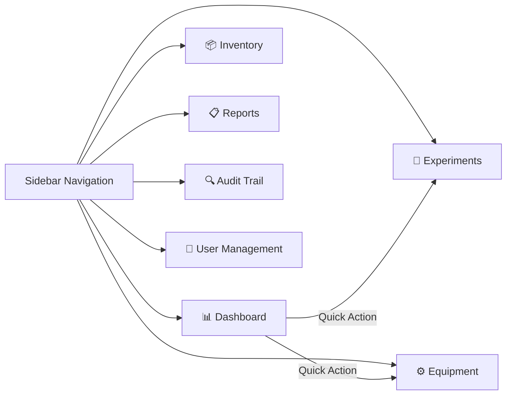

# UI/UX Design Documentation

## Week 5 Deliverable — LDMAS

| Field             | Detail                                                                       |
|-------------------|------------------------------------------------------------------------------|
| **Author**        | Salih                                                                        |
| **Date**          | 2026-08-10                                                                   |
| **Version**       | 1.0                                                                          |
| **Milestone**     | Week 5 — GUI Design & Frontend Implementation                               |
| **Tech Stack**    | WPF (.NET 9.0) · XAML · C# Code-Behind                                      |
| **Prerequisites** | [SystemArchitecture.md](SystemArchitecture.md) · [SecurityArchitecture.md](SecurityArchitecture.md) |

---

## Table of Contents

1. [Design Philosophy](#1-design-philosophy)
2. [Color System](#2-color-system)
3. [Layout Architecture](#3-layout-architecture)
4. [Component Breakdown](#4-component-breakdown)
5. [Navigation System](#5-navigation-system)
6. [Dashboard Design](#6-dashboard-design)
7. [Session Management UI](#7-session-management-ui)
8. [Accessibility & Usability](#8-accessibility--usability)
9. [File Structure](#9-file-structure)
10. [WPF Project Configuration](#10-wpf-project-configuration)
11. [Next Steps — Week 6 Preview](#11-next-steps--week-6-preview)

---

## 1. Design Philosophy

### 1.1 Design Principles

The LDMAS user interface follows four core principles aligned with its laboratory context:

| Principle                  | Rationale                                                                     |
|----------------------------|-------------------------------------------------------------------------------|
| **Clinical Precision**     | A dark, muted color palette evokes the controlled, analytical environment of a laboratory. No distracting vibrant colors — data takes center stage. |
| **Information Density**    | Researchers need to see multiple data dimensions simultaneously. Dashboard KPI cards, data grids, and status indicators provide at-a-glance awareness. |
| **Workflow Efficiency**    | Sidebar navigation ensures all modules are ≤1 click away. Quick action buttons on the dashboard reduce navigation overhead for frequent tasks. |
| **Academic Professionalism** | The interface avoids consumer-grade aesthetics (gradients, animations) in favor of a clean, structured layout appropriate for an institutional tool. |

### 1.2 UI Framework Choice — WPF

| Factor                  | WPF                                    | WinForms                      |
|-------------------------|----------------------------------------|-------------------------------|
| Layout system           | Flexible XAML (Grid, DockPanel, etc.)  | Absolute pixel positioning    |
| Custom styling          | Full template override via Styles      | Limited control appearance    |
| Data binding            | Built-in MVVM support                  | Manual event wiring           |
| Modern appearance       | Borderless windows, transparency       | OS-native chrome only         |
| Resolution independence | Vector-based rendering                 | Pixel-based (DPI issues)      |

**Decision:** WPF was selected for its flexible layout engine, custom styling capabilities, and resolution-independent rendering — essential for a data-heavy application that may run on varying display resolutions.

---

## 2. Color System

### 2.1 Palette Overview

The color system uses a **dark clinical theme** inspired by laboratory LIMS (Laboratory Information Management System) interfaces and scientific monitoring dashboards.

```
┌─────────────────────────────────────────────────────────────────────────┐
│                        LDMAS COLOR SYSTEM                              │
├─────────────────────────────────────────────────────────────────────────┤
│                                                                         │
│  BACKGROUNDS                                                            │
│  ┌──────────┐  ┌──────────┐  ┌──────────┐  ┌──────────┐               │
│  │ #0B1120  │  │ #0F1B2D  │  │ #111827  │  │ #1A2332  │               │
│  │ Window   │  │ Sidebar  │  │ Content  │  │ Cards    │               │
│  └──────────┘  └──────────┘  └──────────┘  └──────────┘               │
│                                                                         │
│  ACCENTS                                                                │
│  ┌──────────┐  ┌──────────┐  ┌──────────┐  ┌──────────┐               │
│  │ #00B4D8  │  │ #10B981  │  │ #F59E0B  │  │ #EF4444  │               │
│  │ Teal     │  │ Emerald  │  │ Amber    │  │ Rose     │               │
│  │ (Primary)│  │ (Success)│  │ (Warning)│  │ (Danger) │               │
│  └──────────┘  └──────────┘  └──────────┘  └──────────┘               │
│                                                                         │
│  TEXT                                                                    │
│  ┌──────────┐  ┌──────────┐  ┌──────────┐                              │
│  │ #E2E8F0  │  │ #94A3B8  │  │ #64748B  │                              │
│  │ Primary  │  │ Secondary│  │ Muted    │                              │
│  └──────────┘  └──────────┘  └──────────┘                              │
│                                                                         │
└─────────────────────────────────────────────────────────────────────────┘
```

### 2.2 Color Token Reference

| Token Name           | Hex Code  | Usage                                          | XAML Key              |
|----------------------|-----------|------------------------------------------------|-----------------------|
| **Window BG**        | `#0B1120` | Outermost window background                   | `WindowBgBrush`       |
| **Sidebar BG**       | `#0F1B2D` | Navigation sidebar panel                       | `SidebarBgBrush`      |
| **Sidebar Hover**    | `#1A2942` | Nav button hover state                         | `SidebarHoverBrush`   |
| **Sidebar Active**   | `#1E3A5F` | Active nav button background                   | `SidebarActiveBrush`  |
| **Top Bar BG**       | `#111827` | Top header bar                                 | `TopBarBgBrush`       |
| **Content BG**       | `#111827` | Main content area                              | `ContentBgBrush`      |
| **Card BG**          | `#1A2332` | Dashboard cards and panels                     | `CardBgBrush`         |
| **Card Border**      | `#1E3044` | Subtle card borders                            | `CardBorderBrush`     |
| **Accent**           | `#00B4D8` | Interactive elements, active indicators        | `AccentBrush`         |
| **Success**          | `#10B981` | Positive metrics, connected status             | `SuccessBrush`        |
| **Warning**          | `#F59E0B` | Pending approvals, attention needed            | `WarningBrush`        |
| **Danger**           | `#EF4444` | Low stock, errors, close button hover          | `DangerBrush`         |
| **Info**             | `#6366F1` | Reports, informational actions                 | `InfoBrush`           |
| **Text Primary**     | `#E2E8F0` | Headings, important labels                     | `TextPrimaryBrush`    |
| **Text Secondary**   | `#94A3B8` | Body text, descriptions                        | `TextSecondaryBrush`  |
| **Text Muted**       | `#64748B` | Subtitles, section labels, disabled text       | `TextMutedBrush`      |

### 2.3 Semantic Color Application

Each accent color has a specific semantic meaning enforced consistently:

| Color   | Semantic Meaning                          | Used For                                            |
|---------|-------------------------------------------|-----------------------------------------------------|
| Teal    | **Primary interaction & identity**        | Active nav, links, user role badge, accent borders  |
| Emerald | **Positive state / success**              | Active status, connected indicator, success metrics |
| Amber   | **Attention / pending action**            | Pending approvals, warnings, review needed          |
| Rose    | **Critical / negative state**             | Low stock, errors, close button, decommissioned     |
| Indigo  | **Informational / neutral action**        | Reports, analytics, non-urgent actions              |

---

## 3. Layout Architecture

### 3.1 Grid Structure

The MainWindow uses a `2×2 Grid` as its root layout:

```
┌──────────────────────────────────────────────────────────────────────┐
│                                                                      │
│  ┌──────────┬──────────────────────────────────────────────────────┐ │
│  │          │                  TOP BAR (56px)                      │ │
│  │          │  [Page Title]     [🔎 Search]     [─ ☐ ✕]           │ │
│  │  SIDEBAR ├──────────────────────────────────────────────────────┤ │
│  │  (260px) │                                                      │ │
│  │          │              MAIN CONTENT AREA                       │ │
│  │ 🔬 LDMAS │                                                      │ │
│  │          │   ┌────────┐ ┌────────┐ ┌────────┐ ┌────────┐       │ │
│  │ ─────── │   │ Card 1 │ │ Card 2 │ │ Card 3 │ │ Card 4 │       │ │
│  │ 📊 Dash  │   └────────┘ └────────┘ └────────┘ └────────┘       │ │
│  │ 🧪 Exper │                                                      │ │
│  │ ⚙️ Equip │   ┌──────────────────────┐ ┌──────────────────┐     │ │
│  │ 📦 Inven │   │  Recent Experiments  │ │  Quick Actions   │     │ │
│  │          │   │  (DataGrid)          │ │  + New Exp       │     │ │
│  │ ─────── │   │                      │ │  + Reg Equip     │     │ │
│  │ 📋 Reprt │   │                      │ │  📋 Report       │     │ │
│  │ 🔍 Audit │   │                      │ │  📦 Inventory    │     │ │
│  │ 👥 Users │   │                      │ │                  │     │ │
│  │          │   └──────────────────────┘ └──────────────────┘     │ │
│  │ ─────── │                                                      │ │
│  │ [SA] Admin│                                                     │ │
│  │ ⏻ Logout │                                                      │ │
│  └──────────┴──────────────────────────────────────────────────────┘ │
│                                                                      │
└──────────────────────────────────────────────────────────────────────┘
```

### 3.2 Responsive Behavior

| Window Size       | Behavior                                       |
|-------------------|------------------------------------------------|
| ≥ 1280 × 768      | Full layout with 4-column metric cards          |
| 900 × 600 (min)   | Cards compress; sidebar remains fixed at 260px  |
| Maximized          | Content area stretches; DataGrid fills space    |

---

## 4. Component Breakdown

### 4.1 Sidebar (Navigation Panel)

| Section           | Content                                                  |
|-------------------|----------------------------------------------------------|
| **Brand Header**  | 🔬 LDMAS logo + "Lab Data Management" subtitle           |
| **Main Menu**     | Dashboard, Experiments, Equipment, Inventory              |
| **Reports/Admin** | Reports, Audit Trail, User Management                    |
| **User Footer**   | Avatar initials, full name, role badge, logout button     |

**Active State Indicator:** A 3px teal left border + darkened background + teal text color. This follows the standard sidebar UX pattern where the active item is visually distinct without competing with content.

### 4.2 Top Bar

| Element            | Purpose                                            |
|--------------------|----------------------------------------------------|
| **Page Title**     | Dynamic text showing current module name           |
| **Search Box**     | Global search input (future implementation)        |
| **Status Dot**     | Green dot + "Connected" for database health        |
| **Window Controls**| Custom ─ ☐ ✕ buttons (borderless window)          |

### 4.3 Dashboard Cards (KPI Tiles)

Four metric cards arranged in a `UniformGrid` with `Columns="4"`:

| Card               | Metric                | Color       | Requirement |
|--------------------|-----------------------|-------------|-------------|
| Active Experiments | Count of In Progress  | Teal icon   | FR-035      |
| Pending Approvals  | Count of Awaiting Review | Amber text | FR-035      |
| Active Equipment   | Count of Active status | Emerald text| FR-035      |
| Low Stock Items    | Count below threshold | Rose text   | FR-035      |

### 4.4 Recent Experiments DataGrid

A styled `DataGrid` with custom column headers (muted text, uppercase, small font) and alternating row colors (`Transparent` / `#141E2E`). Columns:

| Column    | Binding            | Width |
|-----------|--------------------|-------|
| TITLE     | `{Binding Title}`  | `*`   |
| CATEGORY  | `{Binding Category}`| 110   |
| STATUS    | `{Binding Status}` | 120   |
| DATE      | `{Binding Date}`   | 100   |

### 4.5 Quick Actions Panel

Four action buttons with semantic background colors:
- **New Experiment** — Teal-on-dark-blue (`#0D3B66`)
- **Register Equipment** — Green-on-dark-green (`#0D3B2A`)
- **Generate Report** — Indigo-on-dark-purple (`#2D1B4E`)
- **Check Inventory** — Amber-on-dark-orange (`#4C2A0D`)

---

## 5. Navigation System

### 5.1 Page-Based Navigation

Navigation is implemented via **visibility toggling** of `Grid` containers within the content area. Each page is a named `Grid` element that is shown or collapsed:

```csharp
// All pages hidden
foreach (var page in _pages.Values)
    page.Visibility = Visibility.Collapsed;

// Target page shown
_pages[pageName].Visibility = Visibility.Visible;
```

**Why not `Frame` + `Page`?** For this single-window application, visibility toggling is simpler, avoids navigation journal overhead, and preserves page state across switches (e.g., unsaved form data is not lost when switching tabs).

### 5.2 Navigation Map



### 5.3 Module-to-Page Mapping

| Module (FR-MOD)  | Page Name      | Nav Button           | RBAC (Visible To)          |
|------------------|----------------|----------------------|----------------------------|
| FR-MOD-01        | Users          | `BtnNavUsers`        | Admin only                 |
| FR-MOD-02        | Experiments    | `BtnNavExperiments`  | Admin, Manager, Technician |
| FR-MOD-03        | Equipment      | `BtnNavEquipment`    | Admin, Manager             |
| FR-MOD-03        | Inventory      | `BtnNavInventory`    | Admin, Manager, Technician |
| FR-MOD-04        | Reports        | `BtnNavReports`      | All roles                  |
| FR-MOD-05        | AuditTrail     | `BtnNavAuditTrail`   | Admin, Auditor             |
| —                | Dashboard      | `BtnNavDashboard`    | All roles                  |

---

## 6. Dashboard Design

### 6.1 Information Hierarchy

The dashboard follows a **top-to-bottom priority** layout:

```
1. WELCOME BANNER     — Personalized greeting, context setting
2. KPI METRIC CARDS   — At-a-glance operational health (FR-035)
3. RECENT ACTIVITY    — Latest experiment data (scrollable table)
4. QUICK ACTIONS      — Shortcut buttons for frequent tasks
5. SYSTEM STATUS      — Database connectivity and session info
```

### 6.2 KPI Card Design Rationale

Each metric card contains three information levels:

| Level | Element              | Purpose                                    |
|-------|----------------------|--------------------------------------------|
| 1     | Icon in colored box  | Instant visual category identification     |
| 2     | Large number + label | Primary metric value + context             |
| 3     | Small trend text     | Contextual secondary information           |

The large number uses `FontSize="28"` and `FontWeight="Bold"` to create visual dominance — the most important data point is the most visually prominent.

---

## 7. Session Management UI

### 7.1 Implementation (FR-005)

The `MainWindow` includes a `DispatcherTimer` that monitors user inactivity:

| Parameter              | Value                | Source   |
|------------------------|----------------------|----------|
| Check interval         | Every 1 minute       | Timer    |
| Timeout threshold      | 30 minutes           | FR-005   |
| Activity events tracked| Mouse move, key down, mouse click | WPF Preview events |

### 7.2 Timeout Flow

```
User Inactive (30 min)
    → DispatcherTimer fires
        → Session expired dialog shown
            → Redirect to Login Window
```

---

## 8. Accessibility & Usability

### 8.1 Design Decisions for Laboratory Context

| Decision                          | Rationale                                          |
|-----------------------------------|----------------------------------------------------|
| High contrast text on dark BG     | Reduces eye strain during long data entry sessions |
| Consistent icon placement         | Emoji icons left-aligned in all nav buttons        |
| Section labels (MAIN MENU, etc.)  | Groups navigation items into logical categories    |
| Confirmation dialogs              | Prevents accidental logout or application close    |
| Status indicators with color+text | Color-blind friendly: "Connected" text + green dot |

### 8.2 Keyboard Navigation

| Key           | Action                |
|---------------|-----------------------|
| Alt+F4        | Close application     |
| Tab           | Navigate between controls |
| Enter         | Activate focused button |
| Double-click title bar | Toggle maximize |

---

## 9. File Structure

### 9.1 Current UI Layout (After Week 5)

```
src/
├── DataAccess/                          ← Week 3
│   ├── DatabaseConnection.cs
│   └── EquipmentRepository.cs
├── Security/                            ← Week 4
│   └── AuthenticationService.cs
└── UI/                                  ← Week 5 (NEW)
    ├── MainWindow.xaml                  ← Dashboard layout (XAML)
    └── MainWindow.xaml.cs               ← Navigation + window logic
```

### 9.2 Planned UI Expansion (Week 6)

```
src/UI/
├── MainWindow.xaml                      ← Week 5 ✓
├── MainWindow.xaml.cs                   ← Week 5 ✓
├── LoginWindow.xaml                     ← Week 6
├── LoginWindow.xaml.cs                  ← Week 6
├── Controls/
│   ├── ExperimentListControl.xaml       ← Week 6
│   ├── EquipmentListControl.xaml        ← Week 6
│   └── InventoryListControl.xaml        ← Week 6
└── Dialogs/
    ├── AddExperimentDialog.xaml         ← Week 6
    └── AddEquipmentDialog.xaml          ← Week 6
```

---

## 10. WPF Project Configuration

### 10.1 Required .csproj Changes

To enable WPF in the existing .NET 9.0 project, the `.csproj` file must be updated:

```xml
<Project Sdk="Microsoft.NET.Sdk">

  <PropertyGroup>
    <OutputType>WinExe</OutputType>            <!-- Changed from Exe -->
    <TargetFramework>net9.0-windows</TargetFramework>  <!-- Added -windows TFM -->
    <UseWPF>true</UseWPF>                      <!-- Enable WPF -->
    <ImplicitUsings>enable</ImplicitUsings>
    <Nullable>enable</Nullable>
  </PropertyGroup>

  <ItemGroup>
    <PackageReference Include="BCrypt.Net-Next" Version="4.2.0" />
    <PackageReference Include="MySql.Data" Version="26.7.0" />
  </ItemGroup>

</Project>
```

**Key changes:**
- `OutputType` → `WinExe` (suppresses console window)
- `TargetFramework` → `net9.0-windows` (required for WPF)
- `UseWPF` → `true` (enables XAML compilation)

### 10.2 App.xaml Entry Point

Create `App.xaml` to set `MainWindow` as the startup window:

```xml
<Application x:Class="LDMAS.UI.App"
             xmlns="http://schemas.microsoft.com/winfx/2006/xaml/presentation"
             xmlns:x="http://schemas.microsoft.com/winfx/2006/xaml"
             StartupUri="src/UI/MainWindow.xaml">
</Application>
```

---

## 11. Next Steps — Week 6 Preview

### Reporting, Audit Trail & Data Export

Week 6 will build the remaining frontend modules and connect them to the backend:

1. **Login Window** — A dedicated `LoginWindow.xaml` that captures credentials and calls `AuthenticationService.AuthenticateUser()` before showing `MainWindow`.

2. **Equipment CRUD Form** — Replace the Equipment placeholder page with a full DataGrid + form layout connected to `EquipmentRepository`.

3. **Experiment CRUD Form** — Experiment list with status badge rendering and an Add/Edit dialog.

4. **Report Generation UI** — Date range pickers and export buttons for CSV/PDF output (FR-033, FR-034).

5. **Audit Trail Viewer** — Read-only DataGrid with filters (date, user, table, operation type) connected to the `AuditLog` table.

6. **RBAC-Based UI Visibility** — Hide navigation items based on the authenticated user's roles (e.g., Technicians cannot see "User Management").

---

> **Document Classification:** Internal — Internship Project Documentation  
> **Repository:** [LaboratuvaryAutomation](https://github.com/SALIH-A/LaboratuvaryAutomation)  
> **Parent Documents:** [SystemArchitecture.md](SystemArchitecture.md) · [SecurityArchitecture.md](SecurityArchitecture.md)
